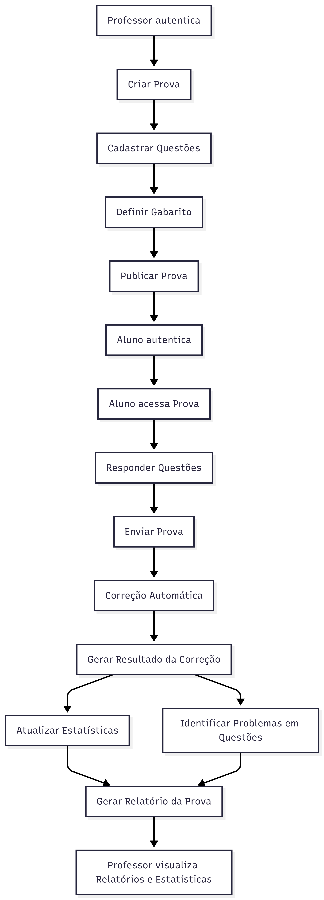

# Sistema de Correção Automática de Provas Simples

## Visão Geral
Sistema para correção automática de provas com gestão de gabaritos e análise estatística de desempenho.

### Roles
- **Professor**: Criação e gestão de provas, gabaritos e relatórios
- **Aluno**: Realização de provas e visualização de resultados

### Funcionalidades Principais
- CRUD de prova
- CRUD de Gabarito
- Página para resposta dos alunos
- Correção automática inicial pelo sistema
- Relatório para o professor
  - Verificação de problemas em questões
  - Análise Estatística da Prova
- Autenticação com roles de professor e aluno

### Tecnologias Utilizadas
- **Banco de Dados**: MongoDB
- **Frontend**: React + TailwindCSS
- **Backend**: Java

---

## 1. Entidades Principais

### 1.1 Usuário (User)
Representa qualquer usuário autenticado no sistema.

**Atributos principais:**   
- id
- nome
- email
- senha
- role (PROFESSOR | ALUNO)
- ativo
- dataCriacao

---

### 1.2 Prova (Exam)
Prova criada pelo professor, composta por várias questões.

**Atributos principais:**
- id
- titulo
- descricao
- professorId
- dataCriacao
- dataInicio
- dataFim
- status (RASCUNHO | PUBLICADA | ENCERRADA)
- configuracoes (ex: embaralharQuestoes, tempoLimite)

---

### 1.3 Questão (Question)
Questão pertencente a uma prova.

**Atributos principais:**
- id
- provaId
- enunciado
- tipo (OBJETIVA | VERDADEIRO_FALSO)
- alternativas
- pontuacao
- ordem

---

### 1.4 Gabarito (AnswerKey)
Define as respostas corretas das questões da prova.

**Atributos principais:**
- id
- provaId
- respostas (questaoId → alternativaCorreta)
- dataCriacao
- dataAtualizacao

---

### 1.5 Tentativa / Resposta do Aluno (Submission)
Representa uma prova respondida por um aluno.

**Atributos principais:**
- id
- provaId
- alunoId
- respostas (questaoId → alternativaSelecionada)
- nota
- corrigida (boolean)
- dataEnvio

---

### 1.6 Resultado de Correção (CorrectionResult)
Resultado detalhado da correção automática.

**Atributos principais:**
- id
- submissionId
- acertos
- erros
- notaFinal
- detalhesPorQuestao

---

### 1.7 Relatório da Prova (ExamReport)
Relatório consolidado para o professor.

**Atributos principais:**
- id
- provaId
- mediaNotas
- maiorNota
- menorNota
- totalSubmissoes
- dataGeracao

---

### 1.8 Análise Estatística (ExamStatistics)
Dados estatísticos sobre o desempenho da prova.

**Atributos principais:**
- id
- provaId
- percentualAcertoPorQuestao
- distribuicaoNotas
- questoesComProblema

---

### 1.9 Problema de Questão (QuestionIssue)
Indica possíveis problemas em questões (ex: alto índice de erro).

**Atributos principais:**
- id
- questaoId
- tipoProblema
- descricao
- dataIdentificacao

---

## 2. Endpoints da API

### 2.1 Autenticação
- `POST /auth/login`
- `POST /auth/logout`
- `POST /auth/register`
- `GET /auth/me`

---

### 2.2 Usuários
- `GET /users`
- `GET /users/{id}`
- `POST /users`
- `PUT /users/{id}`
- `DELETE /users/{id}`

---

### 2.3 Provas
- `GET /exams`
- `GET /exams/{id}`
- `POST /exams`
- `PUT /exams/{id}`
- `DELETE /exams/{id}`
- `POST /exams/{id}/publish`
- `POST /exams/{id}/close`

---

### 2.4 Questões
- `GET /exams/{examId}/questions`
- `POST /exams/{examId}/questions`
- `PUT /questions/{id}`
- `DELETE /questions/{id}`

---

### 2.5 Gabarito
- `GET /exams/{examId}/answer-key`
- `POST /exams/{examId}/answer-key`
- `PUT /exams/{examId}/answer-key`

---

### 2.6 Respostas dos Alunos
- `GET /exams/{examId}/submissions`
- `GET /submissions/{id}`
- `POST /exams/{examId}/submissions`

---

### 2.7 Correção Automática
- `POST /submissions/{id}/correct`
- `GET /submissions/{id}/correction-result`

---

### 2.8 Relatórios
- `GET /exams/{examId}/report`

---

### 2.9 Análise Estatística
- `GET /exams/{examId}/statistics`

---

### 2.10 Problemas em Questões
- `GET /questions/{questionId}/issues`
- `POST /questions/{questionId}/issues`

---

## 3. Observações Arquiteturais
- MongoDB favorece documentos agregados (ex: questões dentro da prova).
- Endpoints devem respeitar autorização baseada em role.
- Correção automática pode ser síncrona inicialmente, evoluindo para processamento assíncrono.
- Estatísticas e relatórios podem ser pré-calculados ou gerados sob demanda.

---
## 4 Fluxos principais dos usuários

## 5. Entidades e relacionamentos
