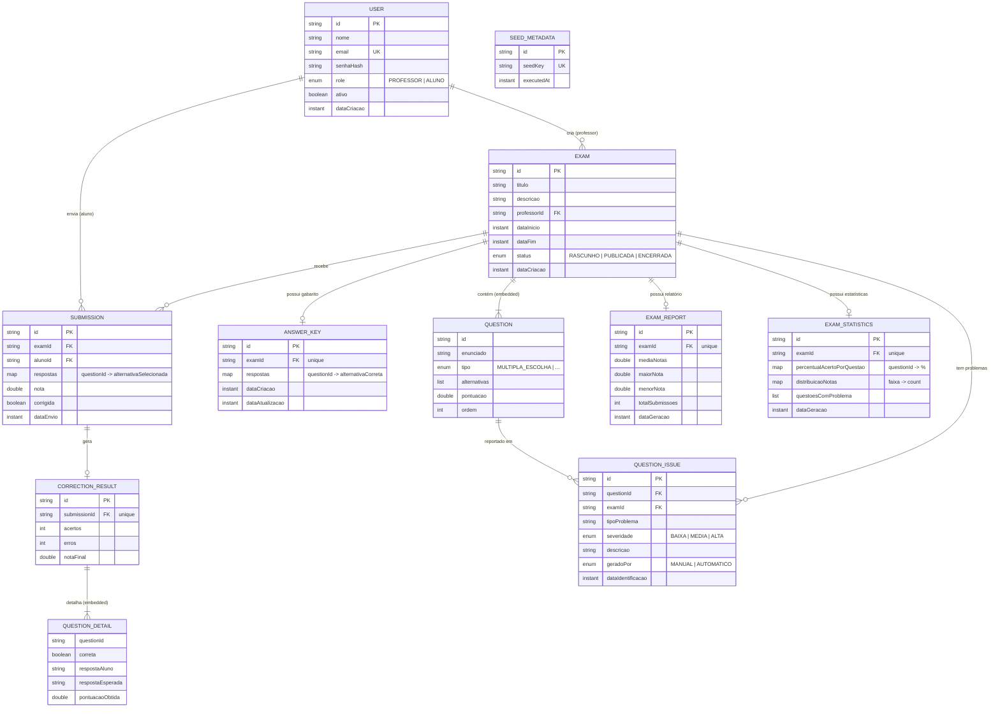

# Entity Relationship Diagram — ExamCorrection

> **Database**: MongoDB (document-oriented)
> Relationships between collections are maintained via reference IDs (not foreign keys).

## Notes

- `QUESTION` is an **embedded document** inside `EXAM` (no separate collection).
- `QUESTION_DETAIL` is an **embedded document** inside `CORRECTION_RESULT` (no separate collection).
- `SEED_METADATA` is an auxiliary collection used only for idempotent data seeding.
- The compound index `(examId, alunoId)` on `SUBMISSION` guarantees **one submission per student per exam**.
- `ANSWER_KEY`, `EXAM_REPORT`, and `EXAM_STATISTICS` each have a **unique index on `examId`** (one-to-one with Exam).
