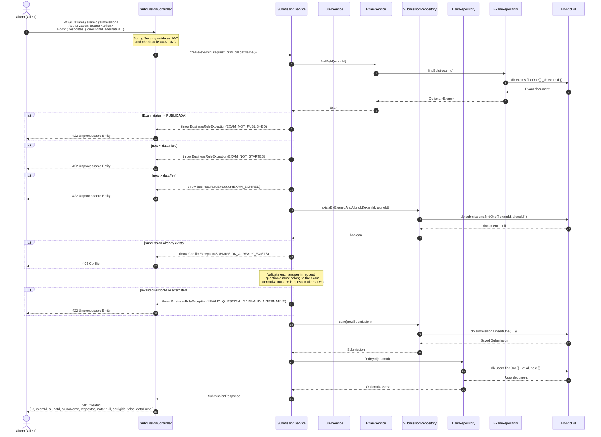

# Sequence Diagram — `POST /exams/{examId}/submissions`

> **Role required**: `ALUNO`
> **Auth**: JWT Bearer Token (Spring Security)



## Response Body (201 Created)

```json
{
  "id": "string",
  "examId": "string",
  "alunoId": "string",
  "alunoNome": "string",
  "respostas": {
    "<questionId>": "<alternativaSelecionada>"
  },
  "nota": null,
  "corrigida": false,
  "dataEnvio": "2024-01-01T10:00:00Z"
}
```

## Business Rules

| Rule | Error Code | HTTP Status |
|------|-----------|-------------|
| Exam must have status `PUBLICADA` | `EXAM_NOT_PUBLISHED` | 422 |
| Current time must be after `dataInicio` | `EXAM_NOT_STARTED` | 422 |
| Current time must be before `dataFim` | `EXAM_EXPIRED` | 422 |
| Student can only submit once per exam | `SUBMISSION_ALREADY_EXISTS` | 409 |
| All `questionId` keys must belong to the exam | `INVALID_QUESTION_ID` | 422 |
| Each answer must be a valid alternative for its question | `INVALID_ALTERNATIVE` | 422 |
| Only users with role `ALUNO` can submit | — | 403 |
